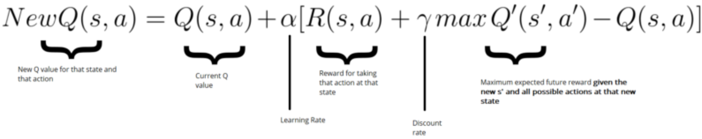

# Stock_Trading_Bot

### *Reference: TensorFlow 2.0: Complete Guide on Brand New TensorFlow by Hadelin de Ponteves (Udemy)*

## Structure
-	Techniques used is Deep Q-Network - Reinforcement Learning
-	Using Pandas-Datareader to retrieve the stock market data from Yahoo!
-	Deque data structure is used for memory

## Deep Neural Network
-	Input Layer with input dimension of state_size
-	Hidden Layer with 3 layer
	-	First hidden layer with 32 neurons and ReLU activation function
	-	Second hidden layer with 64 neurons and ReLU activation function
	-	Third hidden layer with 128 neurons and ReLU activation function
-	Output Layer with output dimension of action_space and linear activation function

## Q-Learning Parameter

-	Gamma value of 0.95
-	Initial epsilon value of 1
-	Final epsilon value of 0.01
-	Epsilon decay of 0.995

## Dataset
-	Using pandas-datareader to retrieve the stock market information per day from Yahoo!
-	Apple (AAPL) stock will be used in this experiement
-	Only Closing price will be used to be fed into our algorithm

## Training
-	Batch size of 32
-	Window size of 10
-	Episodes of 1000

## Result of Algorithm
-	The result is mostly positive profit 
-	It is still not implementable in real life stock market trading
-	It is not reliable only relying on deep Q-learning for stock market predition
-	There more additional techniques such as sentiment analysis on Twitter tweet to back up our stock market trading bot